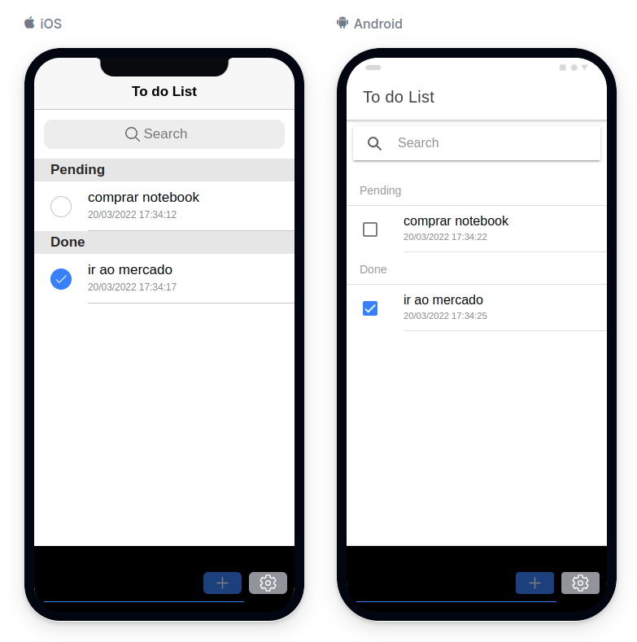
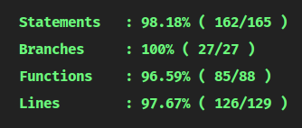

<div id="top"></div>

<br />
<div align="center">
  
  <h3 align="center">To Do List: <strong>PAINEL</strong></h3>
</div>

### Sobre o projeto

Esse projeto foi desenvolvido com o intuito de estudar e melhorar as técnicas de desenvolvimento usando novas tecnologias, ferramentas e padrões.

Essa aplicação é uma lista de tarefas, usada para gerenciar items que precisam ser feitos.

#### Essa aplicação é composta por 2 projetos:
- <strong>Backend</strong>: API feita com Node.JS
- <strong>Frontend</strong>: Painel feito com Ionic + Angular

<br>

<strong>Esse repositório remete ao projeto do frontend</strong>, <a href="https://github.com/marciofmjr/todo-list-node-api" target="_blank">para acessar o projeto do backend, clique aqui</a>

<div align="center">
  
</div>

### Construído com

Esse projeto foi construído utilizando as tecnologias, ferramentas e técnicas abaixo:

* [Ionic 6](https://ionicframework.com/)
* [Angular 13](https://angular.io/)
* [Typescript](https://www.typescriptlang.org/)
* [Jasmine](https://jasmine.github.io/)
* [Testing Library](https://testing-library.com/)
* [Husky](https://github.com/typicode/husky)
* [Github Actions](https://github.com/features/actions)
* [Vercel](https://vercel.com/)

### Cobertura de testes:


### Iniciando

#### Pré-requisitos:
- É necessário de ter o Node instalado

Para iniciar o projeto, execute os comandos abaixo:
```bash
# entre na pasta do projeto clonado
cd ~/pasta-do-repo-clonado

# instale as dependências do projeto
npm install

# para iniciar o servidor com api
npm run start

# para rodar os testes da aplicação
npm run test
```

Se tudo estiver OK, o projeto vai estar rodando no link:
- http://localhost:4200/

### Contato

Marcio Junior - [@marciofmjr](https://twitter.com/marciofmjr) - marciofmjr2@gmail.com
